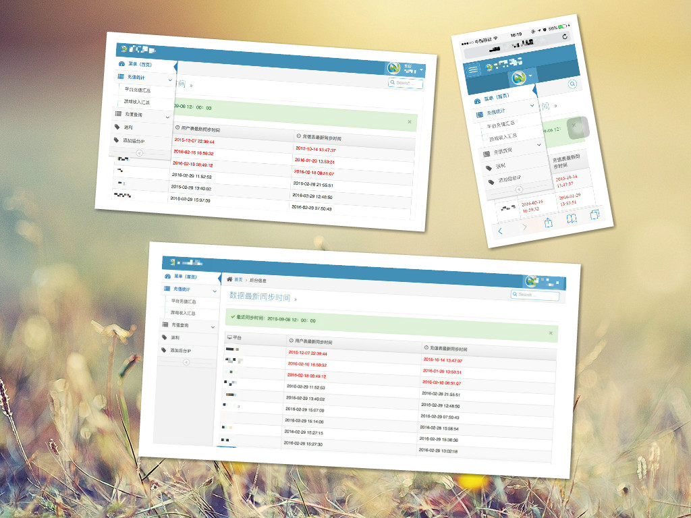
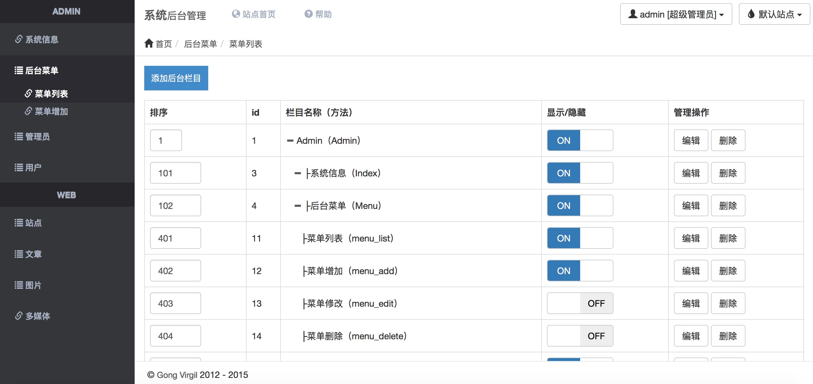

# 简历

# 联系方式

- 手机：15262900637
- Email：gongvirgil@gmail.com
- 微信号：gongvirgil

---

# 个人信息

- 龚强/男/1993.3.12
- 本科/江苏大学计算机系(2009~2013)
- 工作年限：3年
- 技术博客：[http://gongvirgil.github.io/](http://gongvirgil.github.io/)
- Github：https://github.com/gongvirgil

- 期望职位：PHP程序员
- 期望薪资：税前月薪15k~20k
- 期望城市：北京

---

# 开源项目和作品

- 响应式自适应个人主页：[http://gongvirgil.github.io/profile/index-ch.html](http://gongvirgil.github.io/profile/index-ch.html)
- 使用Jekyll+Github Page搭建的博客：[http://gongvirgil.github.io/](http://gongvirgil.github.io/)
- Bootstrap风格后台管理系统：[http://ppmoli.esy.es/admin](http://ppmoli.esy.es/admin)

---

# 技能清单

熟练使用的技能

- Web开发：HTML+CSS+Javascript+Ajax & Linux/Nginx+Apache+Mysql+PHP (精通 使用3年以上)
- Web框架：jQuery/ThinkPHP/MVC模式/CMS/Discuz （精通 使用2年以上）
- 前端框架：Bootstrap （熟练 使用1年以上）
- 版本管理、文档和自动化部署工具：Svn/Git （熟练 使用1年以上）

了解&使用过的技能

- HTML5/CSS3/React/Nodejs/MemCache/Redis/MongoDB/Laravel

---

# 工作经历

## 江苏易乐科技公司 （ 2009年6月 ~ ）

运营技术支持，负责多个平台的以下事情：

- 平台游戏官网&活动
- API接口开发&对接
- 后台维护&功能开发
- 多端响应式自适应后台开发
- 服务器&数据库维护

---

# 主要的项目经验

### 游戏官网与活动

- 游戏官网/首页/文章页/列表页/选服页/游戏卡领取页
- 游戏抽奖活动/平台返利活动/积分兑换活动/游戏内部活动等

### CPL&CPS广告

- 注册入口/Flash动画广告页面
- 广告注入接口/等级查询接口
- 提供给广告商的运营数据后台

### 手机端自适应后台

### Bootstrap风格系统管理后台

主要特点：

- Bootstrap简约风格
- 使用ThinkPHP框架
- 基于MVC模式开发
- 使用Widget扩展代替传统的iframe结构布局
- 基于角色访问控制的权限管理系统(RBAC)

### Linux下服务器自动补单功能 

- Linux下的Crontab定时任务配置
- ThinkPHP开发后台补单API

---

# 致谢
感谢您花时间阅读我的简历，期待能有机会和您共事。

